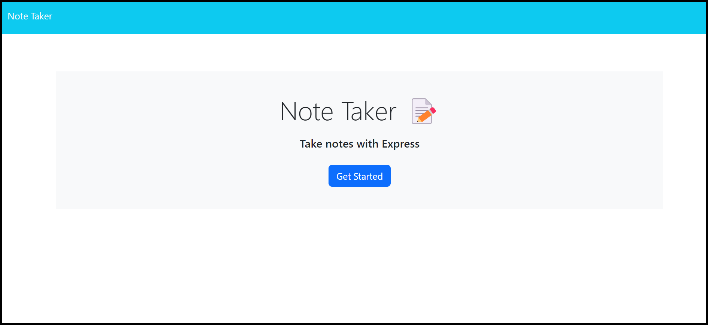
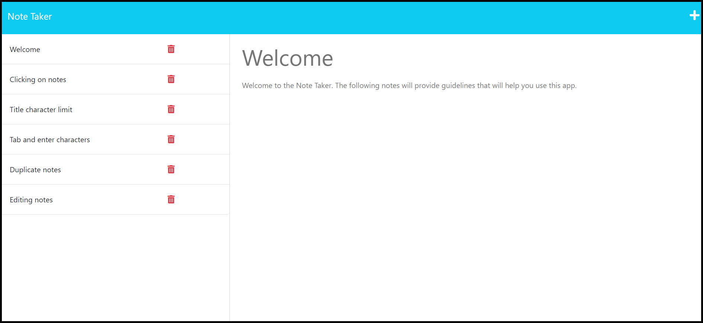
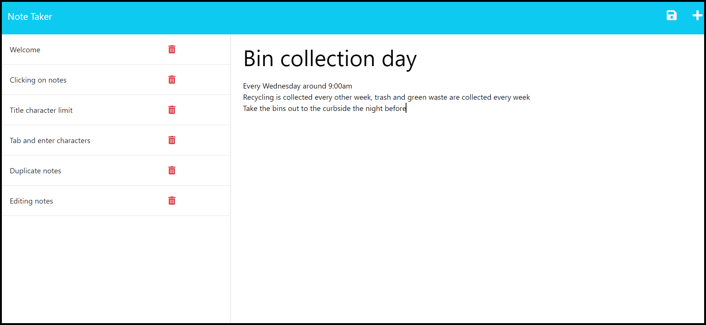
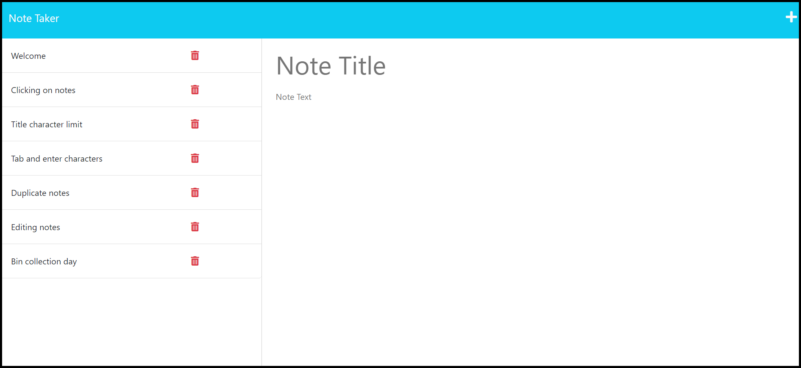

# Challenge 11: Organized Note Taking App

## Description
As part of our routine, we use several types of apps to help us keep track of our responsibilities. We use calendar apps to record important events, and we also use note taking apps to store reminders and other information. The Note Taker app allows you to write and save notes, and you can delete them once you don't need them anymore. This project taught me how to write get, post, and delete routes; use functions from the FileSystem module to modify a JSON file; and add new parameters to objects.

## Table of Contents
- [Description](#description)
- [Installation](#installation)
- [Usage](#usage)
- [Credits](#credits)
- [Contributing](#contributing)
- [Tests](#tests)
- [License](#license)
- [Questions](#questions)

## Installation
No installation is required for this project.

## Usage
The application starts at the home page. Clicking on the "Get Started" button takes you to the notes page. The left side lists your saved notes, and clicking on one of them displays its contents on the right side. In the navigation bar at the top, clicking on 'Note Taker' takes you back to the home page, and clicking the '+' icon enables you to write a new note. Once it has a title and body text, a save button appears. Clicking this button adds your entry to the list of saved notes. Each note has a red trash can icon next to it, and clicking the icon deletes the note.

The following images demonstrate the application's appearance:

**Home page:**

**Reading a note:**

**Writing a note:**

**After saving the note:**

The link to the deployed website can be found [here](insert link here).
## Credits
Received assistance from tutor Katharine Redford and AskBCS assistant Joem.

Also received assistance in the *#02-ask-the-class* Slack channel from students Zach Antunes and Jesus Santos, TA Michael Seaman, and instructor Robbert Wijtman.

The following web resources helped me write the code for this project:

1. [Express routing documentation](https://expressjs.com/en/guide/routing.html)
2. [How to add an id to each object in an array of objects](https://www.tutorialspoint.com/adding-a-unique-id-for-each-entry-in-json-object-in-javascript)
3. [fs.readFile() documentation](https://nodejs.org/dist/latest-v6.x/docs/api/fs.html#fs_fs_readfile_file_options_callback)
4. [Stack Overflow: How to add a new property to an object](https://stackoverflow.com/questions/1168807/how-can-i-add-a-key-value-pair-to-a-javascript-object)
5. [fs.writeFile() documentation](https://nodejs.org/dist/latest-v6.x/docs/api/fs.html#fs_fs_writefile_file_data_options_callback)
6. [JSON.stringify() documentation](https://developer.mozilla.org/en-US/docs/Web/JavaScript/Reference/Global_Objects/JSON/stringify)
7. [Meaning of the ternary operator](https://builtin.com/software-engineering-perspectives/javascript-question-mark-operator)
8. [Splice method for arrays](https://www.w3schools.com/jsref/jsref_splice.asp)

## Contributing
It is currently not possible to edit existing notes or rearrange their order on the left side. If anyone would like to add, or help me add, those features, I would greatly appreciate it.

## Tests
No tests have been written for this application.

## License
No license is attached to this project.

## Questions
If you have any questions for me, you can [follow me on GitHub](https://github.com/GimmeKitties711) or email me at eric20wang.wang@gmail.com.
